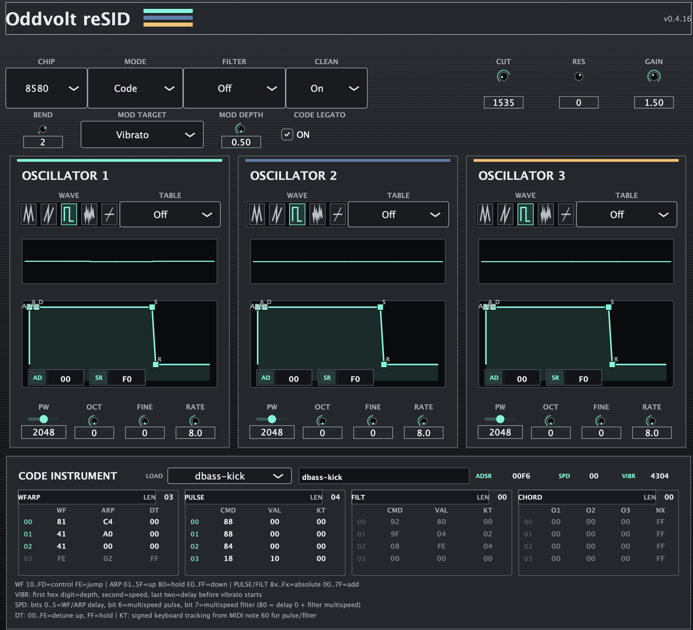
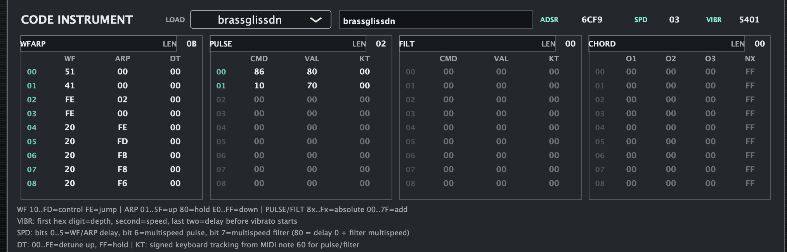

# Oddvolt reSID VST

A JUCE VST3 instrument built around the VICE 3.10 reSID engine. It exposes the
three SID voices as a playable MIDI synthesizer and includes SID-Wizard-style
Code instruments with waveform, pulse, filter, arpeggio, and chord tables.

## Screenshots

### Main interface



### Code instrument tables



## Features

- MOS 6581 and MOS 8580 models
- Mono, poly, unison, Code, and Code Poly voice modes
- Three independently configurable SID oscillators
- Triangle, saw, pulse, and noise waveforms
- ADSR, pulse width, octave, fine tuning, and wavetable controls per oscillator
- Per-oscillator legato glide enable and adjustable glide time
- Pitch-bend and configurable modulation-wheel routing
- Low-pass, band-pass, high-pass, and notch filtering
- Per-voice scopes show each voice through the active SID filter, or its raw waveform when filtering is off. Filtered scopes use isolated instances of the same reSID filter model; the audible mix still uses the SID's shared nonlinear filter. Scope filtering runs only while an editor is open.
- SID-Wizard `.swi` Code instrument library
- WF/ARP, pulse, filter, and chord table playback
- SID-Wizard 4× multispeed instrument support
- Code Legato and three-voice Code Poly playback
- DAW-safe clean ADSR behavior
- Per-instance state restoration for projects using the plug-in on several tracks

## Downloads

Prebuilt Windows x64 and universal macOS VST3 packages are available from the
[GitHub Releases](https://github.com/Misfitd4/reSID-vst/releases) page.

## Building

Requirements include CMake 3.25 or newer and a C++17 compiler. JUCE is fetched
automatically during configuration.

```sh
cmake -S . -B build -DCMAKE_BUILD_TYPE=Release
cmake --build build --config Release --target ReSIDVST_VST3
```

The VST3 bundle is written below `build/ReSIDVST_artefacts/Release/VST3`.

For a universal macOS build:

```sh
cmake -S . -B build -DCMAKE_BUILD_TYPE=Release \
  -DCMAKE_OSX_ARCHITECTURES="arm64;x86_64"
cmake --build build --target ReSIDVST_VST3
```

For Windows x64 from a Visual Studio developer shell:

```powershell
cmake -S . -B build -A x64
cmake --build build --config Release --target ReSIDVST_VST3 --parallel
```

## License

The embedded VICE reSID source is GPL-licensed. Binary distributions of this
plug-in must comply with the GPL terms supplied with the VICE source package.
